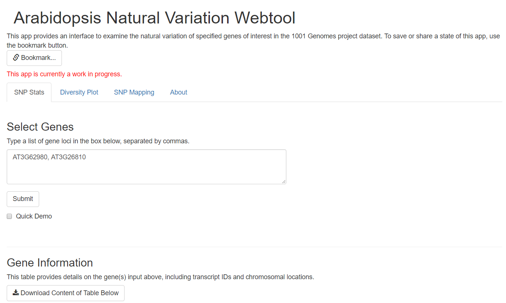
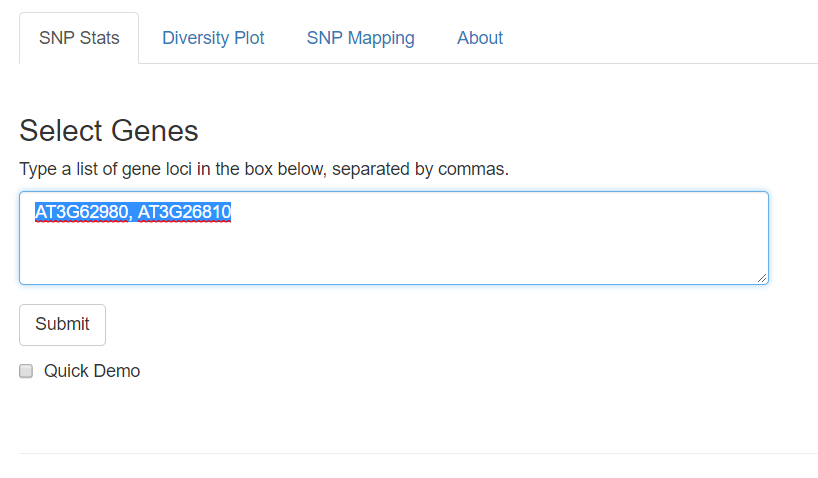
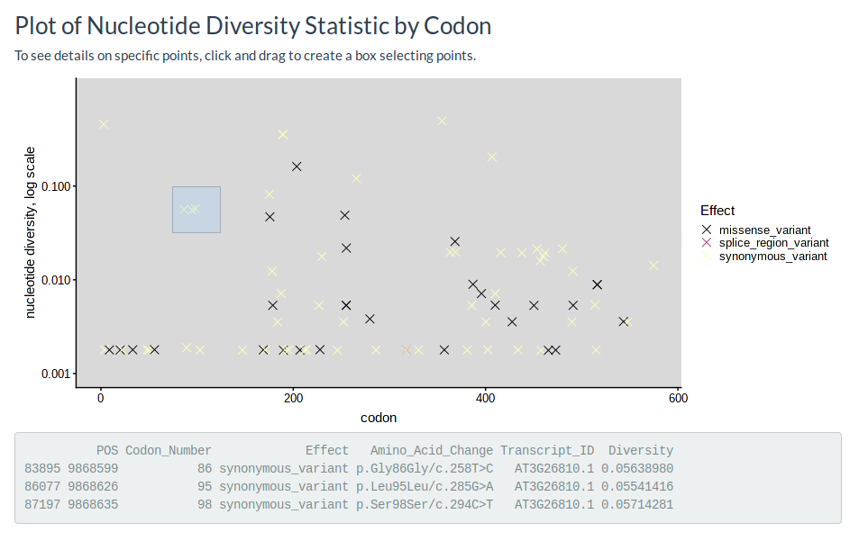
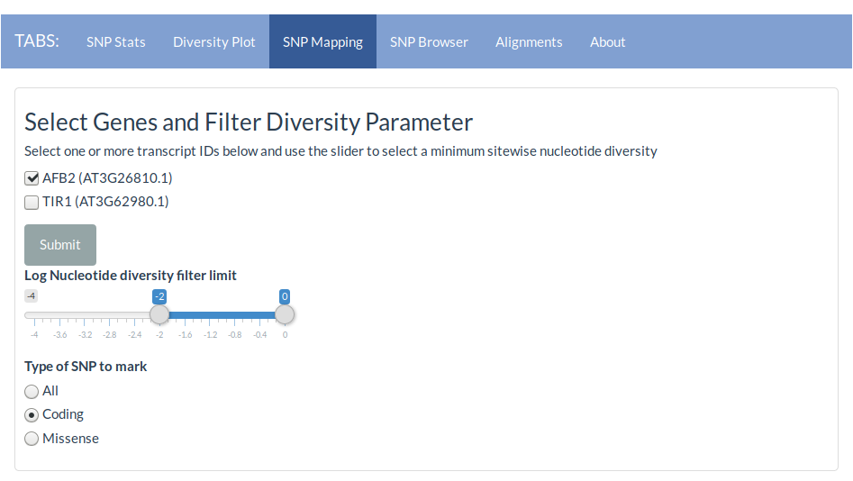
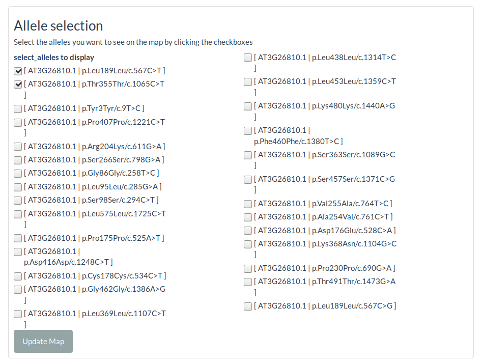
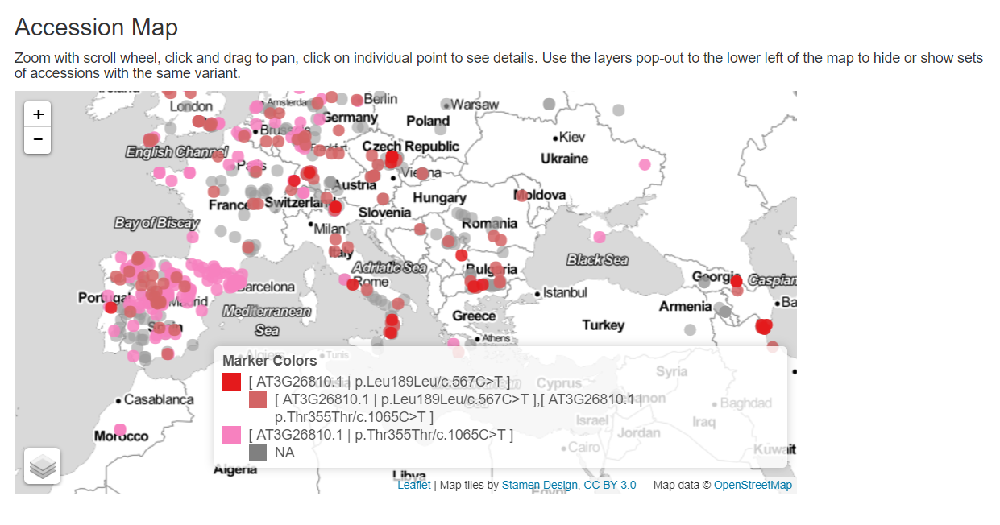
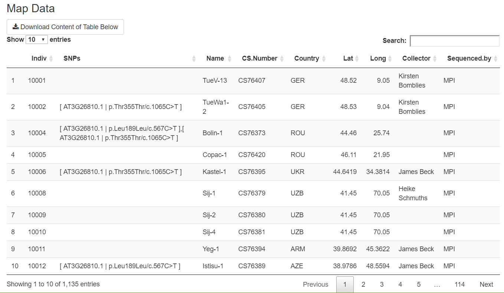

```{r, echo = FALSE, message=FALSE, warning=FALSE}
knitr::opts_chunk$set(warning = FALSE, collapse = TRUE, comment = "#>", tidy = TRUE, out.width = "90%", fig.height=4, fig.width=7, out.extra='style="margin: auto; display: block; padding-top: 15px;"')

```

<style>
  .using-app-insert {
     background-color: #bfbfbf;
     padding: 15px;
     border-style: solid;
     border-color:  #8c8c8c;
     border-radius: 7px 7px 0 0;
     border-width: 1px;
  }
  
  .using-R-insert {
     background-color: #e6e6e6;
     padding: 15px;
     border-style: solid;
     border-color:  #8c8c8c;
     border-radius: 0 0 7px 7px;
     border-width: 1px;
     border-top: 0;
  }  
  
  
  .using-app-insert h2, .using-app-insert h3, .using-app-insert h4 {
     border-bottom: 0;
  }
  
  .using-R-insert h2, .using-R-insert h3, .using-R-insert h4 {
     border-bottom: 0;
  }
  
  img {
    display: block;
    margin: auto;
    width: 90%;
    height: auto;

  }
</style>


# Introduction

This web app and open source software package for the R programming language was built to facilitate exploration of the naturally occurring sequence diversity for your favorite gene or gene family. We hope this app will help plant biologists without bioinformatics experience access the 1001 genomes project’s rich catalog of natural variation, formulate hypotheses and identify new interesting alleles in their favorite gene family.

The 1001 genomes dataset was collected with the intention of genome scale analyses, such as genome wide association studies, in which a particular phenotype is quantified for all of the accessions and sequence variants that are associated with phenotypic variation are identified. [In recent work](https://doi.org/10.1534/genetics.117.3000), we have utilized this rich dataset in a different manner to measure the effects of coding sequence variation on protein functional variation and phenotypic variation. This work has expanded the sequence-function-phenotype map for the auxin-signaling F-box gene family, and this product will facilitate similar analysis other genes, gene families, and genomic regions.

So pick out your favorite gene, gene family or genomic region and follow the steps in this guide to analyze how it varies in plants collected from all over the world. For this example we will be using the auxin-signaling F-box genes, *TIR1* and *AFB2* which have the TAIR locus IDs [AT3G62980](https://www.arabidopsis.org/servlets/TairObject?id=39952&type=locus) and [AT3G26810](https://www.arabidopsis.org/servlets/TairObject?id=38086&type=locus). Click on one of the previous links to search TAIR for the TAIR IDs of your favorite genes.

***
## Molecular Evolution
Before digging into the data, make some hypotheses about what genes, domains and/or positions in your 
favorite gene family might be under different evolutionary pressures. We can make some inferences about the evolutionary pressure acting on particular genes based on the sequence and geographic diversity observed in the 1001 genomes dataset. Thomas Mitchell-Olds and Johanna Schmitt published an excellent overview of the evolutionary inference from natural genetic diversity in *A. thaliana* [@mitchell-olds_genetic_2006]. We can calculate a measure of genetic diversity as the average number of nucleotide differences per site between two DNA sequences in all possible pairs in the sample population, and is denoted by $\pi$. 

Evolutionary pressures potentially exert influence across all levels of biology, nucleotides, genes, genomes, phenotypes, organisms and populations.  This makes any inference from study of genetic diversity contingent on potentially unknown effects of epistasis between genes, population structure, environment, and many other effectors. Additionally, as an agricultural tag-along, much of the genetic variation in *A. thaliana* is due to admixture between populations as the result of human influenced migration. So keep in mind throughout this analysis the limitations of examining a single snapshot in time of a potentially biased collection of frequently self-fertilizing organisms that were dispersed by human migration. Because of these limitations, inferring theories about how evolutionary forces are acting on your favorite genes is very uncertain business. However, if we assume a few things we can make some speculations.  

Assumptions:  
1. Polymorphisms in the dataset are not *completely* detrimental to organismal fitness.  
2. Most nonsynonymous polymorphisms in a gene result in a reduction in function.  

Now, taking a gene-centric view of evolution, here are some of the evolutionary pressures, or types of natural selection, that the genes we are analyzing may be experiencing and what effects these pressures have on genetic diversity. 


### Purifying selection  
If a gene's sequence is highly conserved (low diversity) it may be under [purifying/negative/stabilizing selection](https://en.wikipedia.org/wiki/Negative_selection_(natural_selection)). 
If a genes' function is crucial to the fitness of the organism, and most polymorphisms result in loss of function, we would expect a low level of nonsynonymous polymorphism in this gene. This is because deleterious polymorphisms that do arise in this gene within the population will be outcompeted by the more-fit parent. This results in the decreased genetic diversity in genes under purifying selection.  


### Genetic Drift
If evolutionary pressure is very weak on a gene its sequence might change with no effect on organismal fitness. This allows a gene to accumulate many mutations that may persist in the population or be lost at random. This results in random fluctuations in allele frequencies, which when combined with an appreciable rate of mutation and a sufficient population size yields increased genetic diversity in the population.   

Beyond purifying selection and drift it is very difficult to make any strong inferences on the population as a whole. However there are two more types of selective pressure, balancing or neutral selection and positive or directional selection.

### Directional selection  
If a polymorphism (or allele) is associated with a phenotype that provides an organism with a fitness advantage this phenotype and associated allele may be experiencing directional or positive selection. Positive/directional selection results in an increase in the prevalence of the advantageous allele within the population over time. Directional selection is very difficult to infer and is a very active area of research. Directional selection, like stabilizing selection is associated with reduced genetic diversity within the population under selection. However, unlike stabilizing selection the gene under directional selection will potentially have two major alleles that provide adaptive potential to different environments or genetic backgrounds. 

### Balancing selection
Genes of high diversity may also be under balancing selection, also called neutral divergence. Balancing selection maintains multiple variants for long evolutionary times because different alleles provide selective advantages in different environments or genetic backgrounds. This results in high diversity at the particular site under selection and increased diversity at closely linked neutral sites due to genetic hitchhiking with this allele under balancing selection.  


# Hypothesize
Now go collect and read the literature about your family and make some hypotheses!  
Here are some questions to help you get started:  

What structure/function knowledge is there?  
What is each domain in the protein doing?  
Are there any positions that are of vital importance?  
  
Is there a published protein sequence alignment of your gene family?  
What positions in the protein family are highly conserved?  
What positions are highly variable?  

Is there a published phylogenetic tree of your gene family?  
What are the most recently duplicated sister gene pairs?  
What do you know about the phenotypes of mutants in these pairs?  
Do the genetics suggest these pairs are redundant?  
  
  
## For example
In TIR1 and AFB2 there are 2 domains. The F-box domain interacts with the SCF components [@gray_identification_1999], and the LRR domain binds auxin and Aux/IAA proteins [@kepinski_auxininduced_2004]. The F-box is roughly 40 amino acids and wraps tightly around the SKP1 component of the SCF complex. The LRR is greater than 500 amino acids and binds auxin in a pocket formed by a horseshoe shaped chain of LRRs [@tan_mechanism_2007]. The outside of this horseshoe shape does not have any known interactions other than a dimerization interface [@dezfulian_oligomerization_2016]. Because the F-box domain must interact with the SCF complex for TIR1/AFB2 to perform their known function, we might expect the F-box to be highly conserved. The small size of the F-box also helps strengthen this hypothesis. The LRR domain is much larger and may have differing specificities for Aux/IAAs, so we might expect it to be more diverse. 
We would also expect the residues of the LRR that contact auxin and the Aux/IAA degron to be highly conserved as they are key to the function of these proteins. 

***

# A note on the format of this document
<!--=========================================================================-->
<div  class="using-app-insert"><!--panel start--------------------------------->
## Using the App 


In addition to calling the functions of the r1001genomes package in R directly. There is also a GUI provided in the form of a Shiny app. This app can perform some of the analysis tasks the package is capable of performing, without the need to have knowledge of programming in R. 

In this vignette panels like this one are used to show examples of using the app to achieve similar results as using  the R function calls directly in this vignette. Screenshots will usually be provided to make it clear what section or tab we are talking about  

```{r, echo = FALSE}

knitr::asis_output("
                   ") # This newline required for headings to render after image
```
## Starting the web app

To start the Shiny app, run the following command:
```{r, eval=FALSE}
run1001genomes()
```
The app should appear in a new window, and look similar to the image above.
</div><!--panel end------------------------------------------------------------>
<div  class="using-R-insert"><!--panel start----------------------------------->
## Using R
In these lighter colored panels, the equivalent R code will be displayed.
</div><!--panel end------------------------------------------------------------>
<!--=========================================================================--> 


# Download the chromosome positions and gene models 
The first step in retrieving the natural variation in our genes is to retrieve the information about where the genes are in the genome of Col-0, the laboratory reference accession, and how the mRNA and coding sequence is laid out. This information is called the gene model.

<!--=========================================================================-->
<div  class="using-app-insert"><!--panel start--------------------------------->
## Loading Gene Data in the App
```{r, echo=FALSE}

knitr::asis_output("
                   ") # This newline required for headings to render after image
```
### Selecting Genes and Generating the Gene Model Table
At the top of the first tab (the "SNP Stats" tab) is a text input field where you can input a list of TAIR loci.

The app will download the gene model information as soon as you click submit. Copy and paste your TAIR loci in the box, separated by commas, and click submit.

The app may take a little while to process after clicking the submit button on the first tab, especially if you have a long list of genes, but once this process is complete on the first tab, the data for these genes will be already loaded for the subsequent tabs. 

Once the loading process has finished, the first table you should see scrolling down the SNP Stats tab is the Gene Information table. It should look similar to the table produced in the "Using R" section below.
</div><!--panel end------------------------------------------------------------>
<div  class="using-R-insert"><!--panel start----------------------------------->
## Using R
The code the app uses to download this table is the `getGeneInfo` function. This function is just a simplifying wrapper for the `BioMart` function `getBM`. 

First we must install a load a few package dependencies.
```{r}
library(r1001genomes)
library(DT)
library(dplyr)
library(biomaRt)
```

This downloads the gene model from ENSEMBL plants.
```{r}

tair_ids <- c("AT3G62980", "AT3G26810")
geneInfo <- getGeneInfo(genes = tair_ids, firstOnly = TRUE, inputType = "tair_locus", useCache = TRUE)
```

Now we can give this table a look. We can also freshen up the table a bit with `datatable`. 
```{r}
datatable(geneInfo[, -c(5,6,9)], colnames = c("tair locus", "symbol", "transcript", 
                                              "Chr", "transcript \nstart", "transcript \nend", 
                                              "transcript \nlength"), rownames = FALSE, 
          options=list(paging=FALSE, searching=FALSE))
```
</div><!--panel end------------------------------------------------------------>
<!--=========================================================================-->

Do you have a spreadsheet of loci?  
  
Here is some quick code to make a text string you can copy and paste into the app gene input box.  
```{r}
AFB_loci <- read.csv(system.file("extdata", "AFB_gene_ids.csv", package = "r1001genomes"))
paste(AFB_loci$tair_locus, collapse = ",")
```

Occasionally there are multiple models for a single gene if there are multiple possible transcripts or splice variants. Does your gene have multiple models?


# Download the variants in the 1001 genomes dataset for these genes
The 1001 genomes dataset is stored as a VCF (Variant Call Format) file. This is 
a very efficient format for storing such a large dataset (the 1135 genomes are ~17gb), 
and for some analyses its matrix format is very useful. 

<!--=========================================================================-->
<div  class="using-app-insert"><!--panel start--------------------------------->
## Downloading and processing of VCFs in the App
Upon clicking the "Submit" button on the "SNP Stats" tab, the web app automatically creates a tidy dataframe and calculates the number of unique and nonunique polymorphisms in each region of the gene model as well as calculating the diversity in the protein coding sequence. The diversity is the average number of nucleotide differences per site between all possible pairs of sequences. Diversity is also calculated for only the set of synonymous and nonsynonymous polymorphisms.

The results of these calculations are displayed in the three tables below the Gene Information table.


</div><!--panel end------------------------------------------------------------>
<div  class="using-R-insert"><!--panel start----------------------------------->
## Using R
We can download a set of VCF files for our favorite genes using the `VCFList` function.

```{r, eval=FALSE}
YFG_VCF <- VCFList(geneInfo = geneInfo, by = "transcript", tidy = FALSE)
```

However, for some filtering, summarizing and plotting operations it is more efficient to 
convert the matrix into a very long data frame. Most of the functions in `r1001genomes` 
operate on a long data frame, often called a tidy data frame. We can automatically covert 
our VCF to a tidy data frame by setting the `tidy` argument to `TRUE`.

```{r, cache=TRUE, eval=FALSE}
YFG_VCF <- VCFList(geneInfo = geneInfo, by = "transcript", tidy = TRUE)
```

```{r, echo=FALSE, message=FALSE, warning=FALSE, cache=TRUE}
YFG_VCF <- readRDS(file = system.file("shiny-app", "demo_VCFs.rds", package = "r1001genomes"))
```

We now have a list of very long data frames with all the information on SNPs inside, but much of the details on the effects of these polymorphisms are contained in a single column labeled 'EFF' as a long text string, making it hard to filter and process the data by the individual attributes within that text string.
The `parseEFF` function will separate individual fields of the EFF string into separate columns on a single dataframe, and can be applied to our list of data frames with the `llply` function from the plyr package
```{r eval = FALSE}
YFG_VCF <- llply(YFG_VCF, parseEFF)
YFG_VCF <- llply(YFG_VCF, Nucleotide_diversity)
```


To generate the tables of unique and nonunique polymorphism counts the app calls the function `variantCounts`. In R we can do the same thing.
```{r, cache=TRUE}
TIR1_AFB2_nonunique_variants <- ldply(YFG_VCF, variantCounts, unique = FALSE, .id = "Transcript_ID")
```

Before displaying this table we will again clean it up a bit.

```{r}
formatRound(datatable(TIR1_AFB2_nonunique_variants,
                  colnames = c("transcript", "5' UTR", "intron", "3' UTR",
                               "coding \n synonymous", "coding \n missense",
                               "coding \n total"), 
                  escape = FALSE, rownames = FALSE,
    options=list(paging=FALSE, searching=FALSE)), columns = 2:7, digits = 0)
```

to get the unique polymorphism counts we set the 'unique' argument of `variantCounts` to `TRUE`

```{r}
TIR1_AFB2_unique_variants <- ldply(YFG_VCF, variantCounts, unique = TRUE, .id = "Transcript_ID")

formatRound(datatable(TIR1_AFB2_unique_variants,
                  colnames = c("transcript", "5' UTR", "intron", "3' UTR",
                               "coding \n synonymous", "coding \n missense",
                               "coding \n total"), 
                  escape = FALSE, rownames = FALSE,
    options=list(paging=FALSE, searching=FALSE)), columns = 2:7, digits = 0)
```

The nucleotide diversity for the chosen genes can also be calculated, using the function  `diversityStats`.

```{r}
TIR1_AFB2_diversity_table <- ldply(YFG_VCF, diversityStats, geneInfo = geneInfo, .id = "Transcript_ID")

formatRound(datatable(TIR1_AFB2_diversity_table,
                  colnames = c("transcript",
                               "&pi; transcript",
                               "&pi; coding",
                               "&pi;<sub>N</sub>",
                               "&pi;<sub>S</sub>",
                               "&pi;<sub>N</sub>/&pi;<sub>S</sub>"), 
                  escape = FALSE,
                  options = list(paging=FALSE, searching=FALSE)),
                columns = 1:6, digits = 6)
```


</div><!--panel end------------------------------------------------------------>
<!--=========================================================================-->

## Results
Do these values match your hypotheses? Is there anything unexpected?  
  
For our TIR1 and AFB2 example, we can make several interesting observations based on this dataset.  
1. *AFB2* had higher number of total polymorphisms than *TIR1*, across all subsets of sites except for introns. 
2. *AFB2* also has a higher total coding diversity and higher ratio of diversities at nonsynonymous to synonymous sites. 
  
This was expected, as *TIR1* mutants have a strong loss of auxin sensitivity whereas *AFB2* mutants have a much weaker effect. Therefore, polymorphisms in *TIR1* are much more likely to have an effect on phenotype than polymorphisms in *AFB2*. 
  
# Diversity within each gene  

Now we'll move on to the second "Diversity Plot" tab. This tab will calculate the diversity at each position within the coding sequence of each gene. In addition to calculating the nucleotide diversity of a whole sequence, like the transcript of a gene, we can also calculate the diversity statistic for each position along the reference genome. This could be useful if you suspect a particular region of your gene may be more important to function or more sensitive to nucleotide  or amino acid changes. 

<!--=========================================================================-->
<div  class="using-app-insert"><!--panel start--------------------------------->
## Diversity Plot
The second tab of the app, labeled "Diversity Plot" allows you to plot the nucleotide diversity for each of the genes you selected in the "SNP Stats" tab.  
```{r, echo=FALSE}
imagePath <- "Screenshots/Tab_2_Select_Gene.PNG"
knitr::include_graphics(imagePath)
knitr::asis_output("
                   ") # This newline required for headings to render after image
```
After clicking to the "Diversity Plot" tab, select the first gene you would like to plot then click the submit button.  
  

You should see a plot like the one above. The plot shows Nei's nucleotide diversity by *nucleotide position* of the protein coding region of the gene, though the X-axis is marked by codon number from the N-terminus for convenience. The symbols are differentiated by whether the site has a synonymous or missense variant. If multiple variant types are present at the same position, both markers will be plotted with a slight jitter, to prevent over plotting.  
  
Below the plot is a grey box. If you click and drag across some points in the plot, this will create a selection box. The data for the selected points will appear in the grey box.  
  
Below the plot is a data table with the data provided for all points on the plot. You can click the "Download Content..." button above the table to download a .csv file of this complete table.

</div><!--panel end------------------------------------------------------------>
<div  class="using-R-insert"><!--panel start----------------------------------->

## Using R
The app uses the function `getCodingDiv` to calculate the diversity stat at each nucleotide position of the coding sequence, then uses the function `plotCodingDiv` to plot that information for a single gene. 

```{r}
YFG_Coding_Diversity <- llply(YFG_VCF, getCodingDiv)
lapply(YFG_Coding_Diversity, plotCodingDiv)

```

</div><!--panel end------------------------------------------------------------>

## Results
Do these values match your hypotheses? Is there anything unexpected?  
In *AFB2* there are five alleles with diversity greater than 1E-2 and 20 alleles with diversity greater than 3E-3. *TIR1* has two alleles with diversity greater than 1E-2 and nine alleles with diversity greater than 3E-3. This high number of high frequency alleles in the population suggests that *AFB2* is more likely to be under drift or balancing selection relative to *TIR1* or that *TIR1* is under stronger purifying selection than *AFB2*. It is important to consider however that sampling bias in certain geographic populations could affect these hypotheses. To get some idea of if this is true we will look at the geographic distribution of these alleles.   


<!--================== TEMPLATE START =======================================-->
# Mapping the collection location of accessions by alleles   
As an initial visualization of the population structure that may be influencing the allele frequency and prevalence of alleles in a gene, we can map the collection locations from which the accessions were collected. If the accessions sharing a similar polymorphism are all closely clustered then it is likely several members of the same population derived from a common ancestor are represented. If there are many distantly located accessions sharing the same polymorphism this may result from human-associated migration and admixture or possibly from independent mutation events. In addition to these patterns, look for potential environmental gradients of particular alleles (e.g. is a particular allele only found above/below a certain latitude or only in coastal/desert environments?).

<!--=========================================================================-->
<div  class="using-app-insert"><!--panel start--------------------------------->
## SNP mapping
When you first click on the "SNP mapping" panel you will be faced with a choice of which genes you would like to map accessions for. Click in the checkboxes of the gene or genes you would like map variant accessions for and click submit. Now you can use the "Log nucleotide diversity filter limit" slider to set the minimum diversity of the alleles to map. You can also use the "Type of SNP to mark" radio buttons to select the type of SNPs you would like to show on your map.  
  
This slider and radio buttons will automatically update the list of alleles you can add to your map in the "Allele selection" section. Select any number of alleles and click "Update map" to highlight the location of the accessions containing these alleles on the map.  
  
This will reveal the map with accessions containing the selected alleles shown as colored transparent points. All other accessions will be shown as grey points.  
  
You can change the layering of the points, to remove the other (n/a) accessions or to plot one allele on top using the "Layers" button in the bottom left of the map. 

You can view the full list of accessions in the map along with the alleles those accessions contain directly below the map in the "Map Data" section. You can navigate through this datatable or search for particular alleles using the box at the top right. You can also download the contents of this datatable.



</div><!--panel end------------------------------------------------------------>
<div  class="using-R-insert"><!--panel start----------------------------------->
## Using R
To repeat the mapping of accessions in R, we will first have to filter by diversity the VCF of mutations. We also want to exclude the reference variants (i.e. when GT is 0|0). We'll use some tools from the [tidyverse](http://tidyverse.org/) to do this. 
```{r}
AFB2_missense <- YFG_VCF$AT3G26810.1 %>% 
  dplyr::filter(Diversity > 3*10^(-3) & gt_GT != "0|0" & 
                  Effect == "missense_variant")
head(AFB2_missense)
```
The accession (as ecotype ID) is in the "Indiv" column of this data frame. Now we will need to attach the accession name, latitude, longitude and other data to this data frame. We'll do this with the `addAccDetails` function. The metadata is also available as an included dataset in the r1001genomes package called `accessions`. 

```{r}
AFB2_missense <- labelBySNPs(AFB2_missense)
head(AFB2_missense)
```
Now we can plot the variants. In the app we use the Leaflet package to provide an interactive plot. We can also do this within R.
```{r}
#load the leaflet package 
library(leaflet)
AFB2_missense <- rbind(AFB2_missense[is.na(AFB2_missense$SNPs), ],
                       AFB2_missense[!is.na(AFB2_missense$SNPs), ])

    # make a field with text to be displayed when clicking on a marker
    AFB2_missense$popup <- paste("EcoID:",  AFB2_missense$Indiv,"Name:", AFB2_missense$Name, " SNPs:", AFB2_missense$SNPs)

    # create the color pallet for the map points
    pal <- RColorBrewer::brewer.pal(8, "Set1")
    pallet <- colorFactor(palette=pal, domain=AFB2_missense$SNPs)
map <- leaflet()
    map <- addProviderTiles(map, providers$Stamen.TonerLite,
                     options = providerTileOptions(noWrap = TRUE))

    # groupnames to be used by draw groups of points as separate layers below
    groupnames <- unique(AFB2_missense$SNPs)
    groupnames <- groupnames[!is.na(groupnames)]

    # add markers for NA points first so they are furthest back layer
    map <- addCircleMarkers(map, data=AFB2_missense[is.na(AFB2_missense$SNPs), ], color= "#9b9b9b", group="NA",
                            radius=6, stroke=FALSE, fillOpacity=0.6)

    # for each of the group names, add a set of markers
    for (SNP in groupnames){
          map <- addCircleMarkers(map, data=AFB2_missense[AFB2_missense$SNPs == SNP, ], color= ~pallet(SNPs), group= SNP,
                            radius=6, popup= ~popup, stroke=FALSE, fillOpacity=0.85)
    }

    # add the legend to the map
    map <- addLegend(map, position="bottomright", pal=pallet,
                     values=AFB2_missense$SNPs, title="Marker Colors", opacity=1)

    # add layer control to map to turn on or off groups of points
    map <- addLayersControl(map, overlayGroups=c(groupnames, "NA"),
                            options = layersControlOptions(collapsed = TRUE),
                            position="bottomleft")

    map
```
You can also use the `ggmap` function from the package of the same name to create maps. The "ggrepel" package also helps to handle overlapping labels.

```{r}
library(ggplot2)
library(ggmap)
library(ggrepel)

europe <- get_map(location = 'europe', zoom = 4)
michigan <- get_map(location = 'michigan', zoom = 5)


ggmap(europe) + xlab('longitude') + ylab('latitude') + geom_point(data = AFB2_missense, aes(x = Long, y = Lat), alpha = 0.5, shape = 18, color = "darkgrey") + geom_label_repel(data = subset(AFB2_missense, grepl(pattern = "204", AFB2_missense$SNPs)), mapping = aes(label = Name, x = Long, y = Lat), fill = "white", point.padding = unit(0.5, "lines"), segment.size = 1) 

ggmap(michigan) + xlab('longitude') + ylab('latitude') + geom_point(data = AFB2_missense, aes(x = Long, y = Lat), alpha = 0.5, shape = 18, color = "darkgrey") + geom_label_repel(data = subset(AFB2_missense, grepl(pattern = "516", AFB2_missense$SNPs)), mapping = aes(label = Name, x = Long, y = Lat), point.padding = unit(0.5, "lines"), segment.size = 1) 

```


</div><!--panel end------------------------------------------------------------>
<!--=========================================================================-->

# References


<!--================== TEMPLATE START =======================================--
# heading   
description

<!--=========================================================================--
<div  class="using-app-insert"><!--panel start---------------------------------
## Tab title
some text and picture

</div><!--panel end------------------------------------------------------------
<div  class="using-R-insert"><!--panel start-----------------------------------
## Using R
some text and code snippet
</div><!--panel end------------------------------------------------------------
<!--=========================================================================-->


